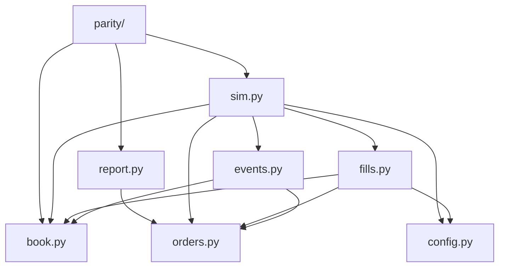

# Architecture Spine — TICK-INFRA Fill Simulator

## Design Paradigm

**Discrete-event simulation with a single logical clock and a total event order.** One merged, strictly ordered stream over L3-MBO per-order events (`A/C/M/T/F`) ∪ latency-delayed order arrivals ∪ deferred fill applications. A deterministic step function advances state. The **core is a pure function**: `simulate(book_event_source, intent_log, config) → (OrderOutcome log, manifest)`. No wall-clock, no strategy code in the loop, no shared state between runs.

| Layer | Module(s) |
| --- | --- |
| Contract / config | `config.py` |
| Domain state (leaves) | `book.py`, `orders.py` |
| Event plumbing | `events.py` |
| Decision | `fills.py` |
| Orchestration | `sim.py` |
| Consumers | `report.py`, `parity/` |
| Entry points | `cli.py` |

## Invariants & Rules



### AD-1 — Discrete-event core, one logical clock

- **Binds:** all
- **Prevents:** two units disagreeing on "now"; out-of-order processing
- **Rule:** every unit reasons in one monotonic `int64` **`ts_event`** nanosecond clock (the CME matching-engine stamp — *not* `ts_recv`). All latency arithmetic and every invariant check use `ts_event`. `OrderIntent.submit_ts_ns` is declared to be in the same GLBX `ts_event` epoch. No `time.time()` / `datetime.now()` anywhere in `src/ticksim/`.

### AD-2 — Intent-log replay boundary [ADOPTED]

- **Binds:** `sim.py`, `parity/`, downstream studies
- **Prevents:** simulator correctness entangled with strategy logic; a non-causal strategy contaminating the parity gate
- **Rule:** the simulator consumes **only** a timestamped `OrderIntent` log (AD-23). It never imports or calls strategy code. A reacting strategy runs two passes: strategy → intent log → `simulate()`; no intra-`simulate()` feedback from fills to *new* intents (auto-cancels within an OCO group are not new intents — AD-25). `sim` **validates** the intent log is causally orderable (non-decreasing `submit_ts_ns`; no `replace`/`cancel` before the matching `submit`; no `cancel` of an unknown `order_id`) and raises `IntentLogError` otherwise. Deeper non-causality (look-ahead pricing) is the producer's responsibility, explicitly outside enforcement scope.

### AD-3 — Single, venue-faithful L3 book

- **Binds:** `book.py`, `sim.py`, `fills.py`
- **Prevents:** two book implementations diverging; the time-priority queue model being unbuildable; our own orders polluting venue state
- **Rule:** exactly one live book, an L3 structure keyed by `instrument_id`, holding **only real venue orders** from the stream as `order_id → (instrument_id, side, price_dbn, size, add_ts_ns, sequence)`. **Our orders are never inserted** — they live only in `OrderTracker`. `sim.py` is the only mutator (via AD-9). `fills.py` and everything else are **read-only**. L2 / aggregate views are derived on demand, never stored twice.

### AD-4 — Package isolation

- **Binds:** `src/ticksim/**`
- **Prevents:** entanglement with the deployed system and the unused async pipeline
- **Rule:** `src/ticksim/` imports **nothing** from `src/data`, `src/research`, `src/detection`, `src/execution`, `src/ml`, `src/risk`, `src/monitoring`, `src/dashboard`. Its only new third-party dependencies are **`databento`** and **`sortedcontainers`** (the latter for the O(log n) book — a naïve `max(dict)` per event is forbidden; it was the measured O(n²) bottleneck in Amendment 9's analysis). Tests in `tests/unit/test_ticksim_*.py` and `tests/integration/`.

### AD-5 — Fill engine is a pure, stateless decision function [ADOPTED]

- **Binds:** `fills.py`, `sim.py`
- **Prevents:** a second copy of order state competing with `OrderTracker`
- **Rule:** `fills.decide(book, tracker, clock_ns, config) → list[FillEvent]` (AD-19). The engine holds no state between calls. Per-order state it needs (cumulative trade volume at the order's price since arrival; live `queue_ahead`) lives **on the order in `OrderTracker`**, maintained by AD-21. The queue model (`BackOfQueueModel` / `TimePriorityModel`) is a strategy object from `config`; `sim.py` applies returned `FillEvent`s through the tracker.

### AD-6 — Fixed module decomposition

- **Binds:** `src/ticksim/`
- **Prevents:** concerns smeared across files; a builder inventing a different split story-to-story
- **Rule:** modules and sole responsibilities: `config.py` (`SimConfig` + presets + named constants), `book.py` (L3 `OrderBook`, `apply_event`, queries), `orders.py` (`OrderIntent`, `FillEvent`, `OrderTracker`, `OrderOutcome`, `Fill`, OCO groups), `events.py` (`BookEventSource` protocol, `DbnMboSource`, stable `merge_streams`), `fills.py` (`decide` + the two queue models), `sim.py` (`SimRun` loop, the AD-20/AD-21/AD-22 seam driving, manifest), `report.py` (3-way P&L), `parity/invariants.py` (the 6 assertion functions), `parity/part_a.py`, `parity/part_b.py`, `parity/gate.py`, `cli.py` (`simulate`, `parity-gate`). New code goes in the owning module or a new module — never bolted onto an unrelated one.

### AD-7 — Dependency direction points inward to the leaves

- **Binds:** `src/ticksim/`
- **Prevents:** import cycles; `book`/`orders` acquiring knowledge of higher layers
- **Rule:** `book.py` and `orders.py` import nothing from `src/ticksim`. Permitted import edges only: `events` → book, orders · `fills` → book, orders, config · `sim` → any ticksim module · `report` → orders · `parity` → sim, report, book, config. No other edges; no cycles. Enforced by a test that walks the import graph.

### AD-8 — One owner of order lifecycle

- **Binds:** `orders.py`, `sim.py`
- **Prevents:** two components disagreeing on an order's state; a fill emitted for an order the tracker doesn't know
- **Rule:** `OrderTracker` is the sole authority on the state machine `intent → in_flight → working → {filled | cancelled | rejected | expired}` (plus `cancel`/`replace` from `in_flight` or `working`). Triggers: `replace` keeps queue priority on a size **decrease**, loses it on a price change; a working order is force-transitioned `working → expired` at the end of its containing `valid_interval` (AD-13); an OCO sibling fill triggers `working → cancelled` on the other legs (AD-25). Every fill and every `OrderOutcome` field is **derived from a tracker transition** — authored nowhere else.

### AD-9 — `apply_event` is the sole authority on MBO → book semantics

- **Binds:** `book.py`, everyone
- **Prevents:** CME/Databento MBO semantics (`A/C/M/T/F` interaction, trade-vs-fill records, transient crossed books, warm-up gaps) reimplemented inconsistently
- **Rule:** exactly one function, `book.apply_event(book, record)`, encodes how an MBO record mutates book state; it consumes `A`, `C`, `M`, `T`, `F`. It **tolerates a `C` or `M` for an unseen `order_id`** (a pre-window order — Amendment 9 §A9.2 measured 0.3 % of `C/M`): treat as a no-op and increment a counter surfaced in the manifest. It **tolerates transient crossed markets** (`bid ≥ ask` for less than `config.MAX_TRANSIENT_CROSS_NS`); a longer-lived cross is a `BookInconsistency`. All other code treats the book as opaque and only calls its query methods.

### AD-10 — Integer arithmetic in the hot path

- **Binds:** all
- **Prevents:** float drift making the "within ±0.25 tick" parity tolerances non-deterministic
- **Rule:** time is `int64` ns; price is `int64` DBN `1e-9` fixed-point (`MNQ_TICK_DBN = 250_000_000`); latency, sizes, counters are `int`. **No `float` between event ingestion and the `OrderOutcome` log.** A test asserts every numeric in the `OrderOutcome` JSONL is integer (no allow-list). `float` appears only in `report.py` (final dollar P&L) and human-facing summaries.

### AD-11 — Bit-for-bit determinism

- **Binds:** all
- **Prevents:** a parity PASS/FAIL that cannot be reproduced; flaky invariant checks
- **Rule:** the only entropy source is one RNG seeded from `SimConfig.seed`. No wall-clock reads. No semantic dependence on `dict`/`set` iteration order (sort explicitly). Same `(book-event-source bytes, intent log, config)` ⇒ **byte-identical `OrderOutcome` log** (scoped to the outcome log; the manifest, which carries tool versions and paths, is excluded from byte-identity). Verified by a run-twice-and-diff test.

### AD-12 — `OrderOutcome` is the fills contract; the manifest is the config contract

- **Binds:** `orders.py`, `report.py`, `parity/`, downstream
- **Prevents:** consumers reaching into simulator internals; silent output-shape drift; `report.py` unable to pair legs or evaluate the decision rule
- **Rule:** one frozen, versioned Pydantic model `OrderOutcome` per order: `{schema_version, trade_id, leg, order_id, kind, side, submit_ts_ns, arrival_ts_ns, terminal_state, fills: list[Fill(px_dbn, size, ts_ns)], queue_rank_at_submit, queue_ahead_size_at_submit, time_to_fill_ns, arrival_best_bid_dbn, arrival_best_ask_dbn, adverse_selection}`. `kind` is frozen: `{marketable, marketable_limit, passive_limit}`. `leg ∈ {entry, exit}`; `trade_id` is opaque, assigned by the intent-log producer, and links an entry order to its exit order. Consumers read fills **only** from `OrderOutcome` and config/fees/multiplier **only** from the run manifest's `SimConfig` dump. Any field change bumps `schema_version`.

### AD-13 — Session mask: three distinct failures [ADOPTED, split]

- **Binds:** `sim.py`, `orders.py`
- **Prevents:** a silently dropped order/fill in a masked region; aborting on a normal "limit rode through the close"
- **Rule:** `SimRun` takes explicit `valid_intervals: list[(start_ns, end_ns)]`, **half-open `[start, end)`**, = RTH minus CME halts/maintenance. (a) An `OrderIntent` `submit_ts_ns` outside the union ⇒ `IntentLogError` (bad analyst input). (b) A working order is force-transitioned `working → expired` at the end of its containing interval (AD-8) — a normal `expired` `OrderOutcome`. (c) With (b) in place, a *fill* outside the mask is impossible; if one occurs it is an `InvariantViolation`, not an analyst-facing abort. Databento-`degraded` days are recorded in the manifest, **not** auto-excluded.

### AD-14 — "Three ways" = 2 sim runs, 3 reports [ADOPTED]

- **Binds:** `sim.py`, `report.py`
- **Prevents:** one run juggling three P&Ls with shared mutable state; a variant that can't be reproduced independently
- **Rule:** exactly two `SimRun`s per study — `config = PRIMARY` and `config = OPTIMISTIC` — producing two independent `OrderOutcome` logs. `report.py` emits three figures: **(a)** PRIMARY fills; **(b)** PRIMARY fills with a post-hoc 1-tick adverse slip applied to the `leg == entry` and `leg == exit` fills, direction from `side` (a pure P&L transform, never a simulation); **(c)** OPTIMISTIC fills. A decision rule is evaluated on (a) **and** must also hold under (b). Round trips are paired by `trade_id`; dollars via `config.DOLLARS_PER_INDEX_POINT` (AD-24).

### AD-15 — Presets are seal-bound constants

- **Binds:** `config.py`
- **Prevents:** the decision-bearing model silently drifting from what was pre-registered
- **Rule:** `PRIMARY` and `OPTIMISTIC` are module-level `SimConfig` constants encoding preregistration §2.1 exactly — `PRIMARY`: `BackOfQueueModel`, 250 ms RT latency, `$0.72` exch+reg + **`$0.58` seal-default commission**, no own-impact; `OPTIMISTIC`: `TimePriorityModel`, 50 ms. Every field carries a comment citing its seal section. Changing any **value** is a pre-registration violation absent a new seal amendment. A study overriding commission builds a *derived* config, records it in the manifest, and its output is §6-**secondary** only.

### AD-16 — The six Part-B invariants are defined once

- **Binds:** `parity/`, `tests/unit/`
- **Prevents:** the ≥1000-order gate run and the unit tests checking subtly different things
- **Rule:** the six invariants — (1) no price-improvement vs the touch *snapshotted at the arrival tick, after all same-`ts` book deltas are folded* (AD-20); (2) a passive limit never fills through its limit; (3) `fill_ts_ns ≥ submit_ts_ns + latency_ns`; (4) reconstructed queue position non-negative and non-increasing until terminal; (5) cumulative partials ≤ order size, and no fill without liquidity at/through the price; (6) strict causality (only events with `ts_event ≤ clock` used) — are implemented **once** as pure assertion functions in `parity/invariants.py`, raising `InvariantViolation`. Consumed by both `parity/part_b.py` and `tests/unit/`.

### AD-17 — Part A replays reconstructed real orders, not outcomes

- **Binds:** `parity/part_a.py`
- **Prevents:** feeding the answer back in; a false PASS from assuming everything was marketable
- **Rule:** Part A builds its `OrderIntent` log by reconstructing the **orders** the live bots placed — from `data/mim_nb/orders.csv` and yank's equivalent where they carry real order type + limit price, else from the `trades.db` row + metadata (`tp_price`/`sl_price`) — preserving the real type (bracket: limit entry, TP-limit / SL-stop exit, as an OCO group per AD-25) and the AD-23 replace convention. The live broker fill price is the **comparison target**, never a simulator input. If the sim leaves an exit unfilled where the real exit filled: the sim's exit price is taken as the touch it could have crossed at `exit_ts` plus the model's slippage, and the case is **recorded and counted as a defined-magnitude parity miss** — never silently excluded.

### AD-18 — Fill engine consumes an abstract L3 `BookEventSource`

- **Binds:** `events.py`, `fills.py`, `sim.py`
- **Prevents:** H1's future grid-cache forcing a rewrite of the engine
- **Rule:** `BookEventSource` is a `Protocol` yielding **L3 MBO-equivalent per-order events** (`A/C/M/T/F` each with `order_id`, `ts_event`, `sequence`) in file order. `DbnMboSource` (streams `.dbn.zst`, never fully decompressing) is the only impl now; a compact L3 cache is a future impl. `sim.py` and `fills.py` depend on the protocol, never on `databento` types.

### AD-19 — `FillEvent`

- **Binds:** `orders.py`, `fills.py`, `sim.py`
- **Prevents:** two builders shaping the fill-engine return type incompatibly; incremental-vs-cumulative double-counting
- **Rule:** `FillEvent` is a frozen model in `orders.py`: `{order_id: str, px_dbn: int, size: int, ts_ns: int}`. It is **strictly this-tick incremental** (the new fill delta, never "all fills so far"). It carries **no** queue-rank or adverse-selection field. `sim.py` applies each via one named `OrderTracker` method that is the sole path to a partial/terminal fill transition (AD-8).

### AD-20 — Canonical total event order

- **Binds:** `events.py`, `sim.py`, `fills.py`, `parity/`
- **Prevents:** a same-`ts` trade vanishing or double-counting; non-deterministic book corruption from an unstable sort; the "touch at arrival" being ambiguous
- **Rule:** the merged stream has one total order: `(ts_event, class_rank, sequence)` with `class_rank`: `book_delta (0) < order_arrival (1) < deferred_fill_apply (2)`. `merge_streams` is a **stable** k-way merge. Per distinct `ts_event` `T`: fold **all** book deltas at `T` via `apply_event`, run `observe_book_event` after each (AD-21); **then** inject order arrivals at `T`; **then** call `fills.decide` once; **then** `sim` applies returned `FillEvent`s. The passive-fill "volume after arrival" counts trades with `ts_event` **strictly greater** than the order's arrival `ts_event` (a same-`T` trade sorts before the arrival and is not counted).

### AD-21 — Book-event → order-state seam

- **Binds:** `sim.py`, `orders.py`, `fills.py`
- **Prevents:** the passive-fill counter having no owner (AD-9 forbids `book` touching the tracker); ambiguity over what decrements `queue_ahead`
- **Rule:** `sim.py` is the **sole driver** of this seam. Immediately after each `apply_event`, `sim` calls `queue_model.observe_book_event(tracker, record)`. It updates per-order counters by these enumerated rules only: a `T` at or through our order's price decrements that order's `queue_ahead`; a `C` or a size-reducing `M` of a **resting order ahead of us** (earlier `add_ts_ns`, or equal `add_ts_ns` and earlier `sequence`) decrements it; nothing else moves it. `fills.decide` is then a pure function of the resulting tracker state.

### AD-22 — Queue position: computed once, one interface, one formula

- **Binds:** `sim.py`, `fills.py`, `orders.py`, `parity/`
- **Prevents:** `queue_rank`/`queue_ahead` computed in two places or two ways; `TimePriorityModel` unbuildable
- **Rule:** both queue models implement one interface: `queue_ahead_size(book, side, price_dbn, our_arrival_ts_ns) -> int` — `BackOfQueueModel` counts every resting order at the price; `TimePriorityModel` counts only those with `add_ts_ns < our_arrival_ts_ns` (ties broken so our order is always last at its price at submit). `sim` calls it **exactly once**, at the order's arrival tick, and writes `queue_rank_at_submit` and `queue_ahead_size_at_submit` onto the tracker order. Back-of-queue fill quantity: `filled = clamp(cum_trade_vol_at_price_since_arrival − queue_ahead_size_at_submit + Σ queue_ahead_decrements, 0, order_size)`. `report`/`parity` read the queue fields only from `OrderOutcome`.

### AD-23 — `OrderIntent` is a frozen, versioned schema

- **Binds:** `orders.py`, `sim.py`, `parity/part_a.py`, downstream intent-log producers
- **Prevents:** the strategy producer and `part_a`'s reconstruction encoding replaces or legs differently — which silently breaks parity
- **Rule:** `OrderIntent` is a frozen Pydantic model, parallel to `OrderOutcome`: `{schema_version, action: {submit, cancel, replace}, order_id, trade_id, leg: {entry, exit}, kind: {marketable, marketable_limit, passive_limit}, side, size, limit_px_dbn: int | None, submit_ts_ns, replaces_order_id: str | None, oco_group_id: str | None}`. **Replace convention:** one record with `action == replace` reusing `order_id` (never cancel + new). The intent log is JSONL, one record per line, non-decreasing `submit_ts_ns`.

### AD-24 — Monetary values are report-layer only

- **Binds:** `config.py`, `report.py`, `sim.py`
- **Prevents:** fees having no legal path to `report.py`; a `float` fee entering `OrderOutcome` (AD-10)
- **Rule:** no monetary field ever enters `OrderOutcome`. `report.py` reads `commission`, `exch_reg_fee`, and `DOLLARS_PER_INDEX_POINT` from the run manifest's `SimConfig` dump (a run artifact — permitted). `config.py` defines `DOLLARS_PER_INDEX_POINT = 2` (MNQ; tick = `$0.50`) as a named, seal-cited constant; `report.py` is its only consumer.

### AD-25 — OCO / bracket groups are a first-class tracker concept

- **Binds:** `orders.py`, `sim.py`, `parity/part_a.py`
- **Prevents:** bracket handling being ad-hoc; a sibling-cancel being mistaken for AD-2 feedback
- **Rule:** an OCO group (`oco_group_id`) links a set of orders (a bracket = entry + TP + SL). The cascade is **leg-aware** (amended 2026-08-29): when an **`exit`**-leg member reaches `filled`, `OrderTracker` deterministically transitions the other members `working|in_flight → cancelled` **in the same tick**; when an **`entry`**-leg member fills, nothing is cancelled — the exits stay live so the position can be closed and `parity/part_a.py` can replay the real exit fill. This is bookkeeping the broker also performs; it generates **no new `OrderIntent`** and does not violate AD-2.

### AD-26 — Parity-gate output contract

- **Binds:** `parity/gate.py`
- **Prevents:** an under-delivered verdict that doesn't meet §4's "frozen SHA in the amendment"; fail-fast vs run-all ambiguity in Part B
- **Rule:** `gate.py` emits an append-only **amendment stub** with a fixed template: sample `N`; the three Part-A figures (MAE, p90, signed bias) each vs its `config` tolerance; per-trader breakdown; Part-B per-invariant violation counts; the simulator commit SHA via an explicitly-permitted `subprocess` `git rev-parse HEAD` (the one sanctioned subprocess call — AD-4/AD-11 otherwise stand); the verdict; the cycle number (supplied by the analyst on the CLI — cycle-count and the 15-working-day kill-criterion clock are **out of code**). **Part B runs all ≥1000 synthetic orders, collects every violation, and FAILs if the set is non-empty** (not fail-fast). Gate verdict = **Part A PASS AND Part B PASS**.

### AD-27 — Parity thresholds are seal-bound constants

- **Binds:** `config.py`, `parity/`
- **Prevents:** the decision thresholds drifting from the seal
- **Rule:** `config.py` names, with seal citations and a change-needs-amendment comment: `PARITY_MAE_MAX_TICKS = 1.0`, `PARITY_P90_MAX_TICKS = 2.0`, `PARITY_SIGNED_BIAS_MAX_TICKS = 0.25`, `PART_A_MIN_N = 28`, `PART_B_MIN_ORDERS = 1000`, `MAX_TRANSIENT_CROSS_NS = 50_000_000`. Changing a value is a pre-registration violation absent a new amendment.

### AD-28 — `adverse_selection` via a bounded deferred check

- **Binds:** `sim.py`, `orders.py`
- **Prevents:** a forbidden look-ahead in `fills.decide`; a second replay pass (AD-14 says exactly two `SimRun`s)
- **Rule:** `adverse_selection` (book state 1 s after the fill — seal §2.1) is computed by `sim` via a bounded deferred-check queue processed as the clock advances. The tracker order stays mutable **for this one field only** until `fill_ts_ns + 1_000_000_000` or run end, then serialized. Not a second replay.

## Consistency Conventions

| Concern | Convention |
| --- | --- |
| Naming | modules per AD-6; Pydantic models `PascalCase`; ns fields suffixed `_ns`; DBN fixed-point price fields suffixed `_dbn`; queue models `BackOfQueueModel` / `TimePriorityModel` |
| Data & formats | intent log = JSONL (`OrderIntent`/line, ascending `submit_ts_ns`); `OrderOutcome` log = JSONL; manifest = JSON (input paths + SHA-256, `SimConfig` dump, seed, `valid_intervals`, `degraded`-day + unseen-`C/M` counts, `schema_version`s, `databento`/`sortedcontainers`/tool versions, sibling-run id) |
| Errors | typed exceptions for control-significant failures — `MaskViolation`, `IntentLogError`, `InvariantViolation`, `BookInconsistency`; no bare `assert` for anything the parity verdict depends on |
| State & mutation | only `SimRun` mutates the book and the tracker; all other functions pure/read-only; `SimConfig` `frozen=True` |
| Logging | stdlib `logging`, `logger = logging.getLogger(__name__)`; progress at a configurable record interval, never per-event |
| Types & style | mypy strict; `|` unions; `list[T]`; black-88 (never hand-format); deliberately **synchronous** — no `asyncio` (departs from the repo's async-pipeline norm; justified — offline batch tool, AD-2 pure core) |

## Stack

| Name | Version |
| --- | --- |
| Python | ^3.11 |
| pydantic | ^2.0 (2.12.x installed) |
| databento | 0.85.0 |
| sortedcontainers | ^2.4 |
| pytest | repo pin ^7.4; .venv runs 9.x — pin against the .venv |

## Structural Seed

```text
src/ticksim/
  __init__.py
  config.py        # SimConfig (frozen), PRIMARY, OPTIMISTIC, named constants (AD-24/27)
  book.py          # OrderBook (L3, per instrument_id, sortedcontainers), apply_event, queries
  orders.py        # OrderIntent, FillEvent, Fill, OrderTracker, OrderOutcome, OCO groups
  events.py        # BookEventSource protocol, DbnMboSource, merge_streams (stable)
  fills.py         # decide(), BackOfQueueModel, TimePriorityModel, observe_book_event
  sim.py           # SimRun (AD-20 loop, AD-21/22 seam, AD-28 deferred queue), manifest
  report.py        # three_way_report()
  parity/
    __init__.py
    invariants.py  # the 6 assertion functions (AD-16)
    part_a.py      # real-order reconstruction + replay + metrics vs trades.db
    part_b.py      # per-window synthetic order generation + full invariant sweep
    gate.py        # runs A + B, emits the amendment stub (AD-26)
  cli.py           # entry points: `simulate`, `parity-gate`
tests/unit/test_ticksim_*.py
tests/integration/test_ticksim_parity.py
```

- **First story acceptance includes** adding `databento` and `sortedcontainers` to `pyproject.toml` (Amendment 9 §A9.5 makes the `databento` entry a required pre-build step).
- **Operational envelope:** offline batch tool, run from `cli.py` on the KVM4 (4 vCPU / 16 GB / 200 GB). No service, no daemon, no network except `DbnMboSource` reading local `.dbn.zst`. A **study** = one `study-id/` dir (`study_id = sha256(source-manifest ∥ intent-log-sha ∥ config-hash)`) containing `primary/` and `optimistic/` subdirs, each with a manifest + `OrderOutcome` log; each manifest names its sibling. Reproducibility is the manifest (AD-11).
- **Test data on hand:** `data/tick/_test/glbx-mdp3-20260622.mbo.dbn.zst` (2.5 h MNQ.FUT, 22.5 M records) — the fixture for `DbnMboSource` and integration tests.

## Capability → Architecture Map

| Seal requirement | Lives in | Governed by |
| --- | --- | --- |
| §2.1 primary model | `config.PRIMARY` + `fills.BackOfQueueModel` | AD-5, AD-15, AD-21, AD-22 |
| §2.1 secondary model | `config.OPTIMISTIC` + `fills.TimePriorityModel` | AD-5, AD-15, AD-22 |
| §2.2 not-modelled list | not built; halts handled by AD-13 mask | Deferred |
| §2.3 three-way reporting | `report.three_way_report` | AD-14, AD-24 |
| §3 / A8 Part A (real-fill replay) | `parity/part_a.py` | AD-17, AD-12, AD-23, AD-25 |
| §3 / A8 Part B (≥1000 synthetic, 6 invariants) | `parity/part_b.py` + `parity/invariants.py` | AD-16, AD-27 |
| §4 kill criterion / verdict / frozen SHA | `parity/gate.py` | AD-26, AD-27 |
| §5 integrity (ts monotonic, transient-cross, A/C/M/T/F, warm-up gaps) | `book.apply_event` + `parity/gate.py` preflight | AD-9, AD-20 |
| A9.3/A9.4 (`instrument_id` keying) | `book.py` | AD-3 |

## Deferred

| Deferred | Why it can wait |
| --- | --- |
| H1 grid-cache / compact L3 intermediate | not needed for the ~11 GB parity gate; AD-18 (now L3-explicit) keeps the seam open. Revisit when an H1 grid pass on the KVM4 exceeds ~1 day. |
| The H1 strategy (intent-log producer) | downstream; AD-2's two-pass structure + AD-23's frozen `OrderIntent` accommodate it |
| Multi-instrument / portfolio simulation | H1 is single-instrument MNQ front-month. **Not "no rework":** the book is per-`instrument_id`, but `OrderTracker`, `fills.decide`, `merge_streams`, `valid_intervals`, and `report` P&L would need per-id keys. |
| Own-order market-impact model, variable-latency model | seal §2.2 — out of scope; each would be a new seal amendment + a new `SimConfig` field |
| Live / streaming operation | offline batch only; `BookEventSource` is a pull iterator |
| Parity gate **v2** (Part A at N ≥ 100, ~Nov–Dec) | seal Amendment 8 §A8.4; same `parity/part_a.py`, larger sample |

## Open Questions

- **[ASSUMPTION]** yank live-combine orders have a machine-readable order record (type + price) analogous to `data/mim_nb/orders.csv`. If only `trades.db` exists for yank, its 8 fills fall back to reconstructed bracket orders from `tp_price`/`sl_price` in the metadata JSON. Resolve at the Part A story.
